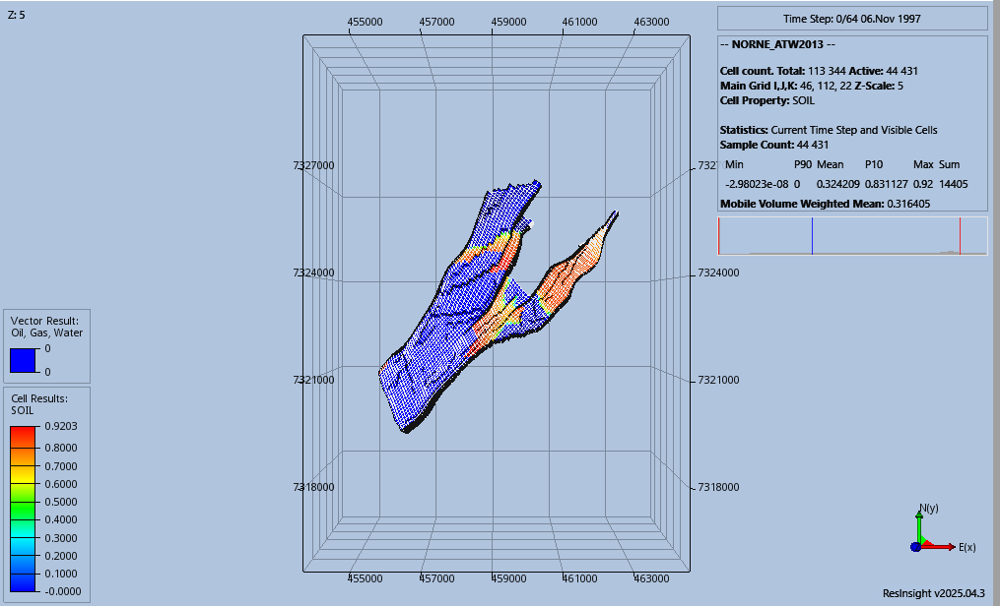
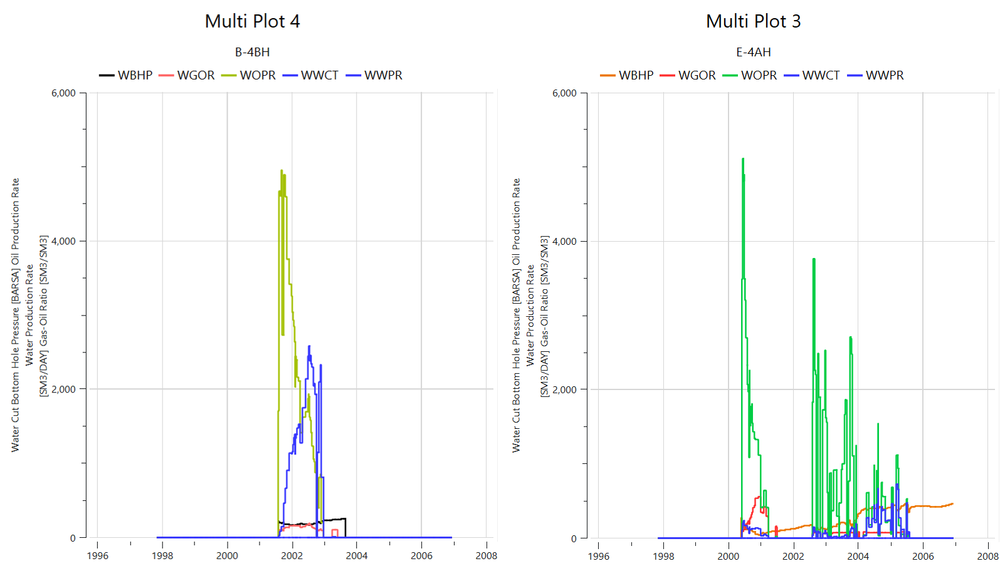
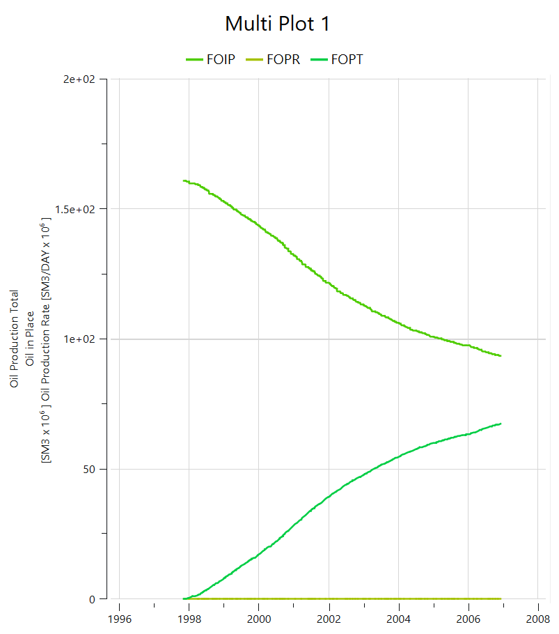
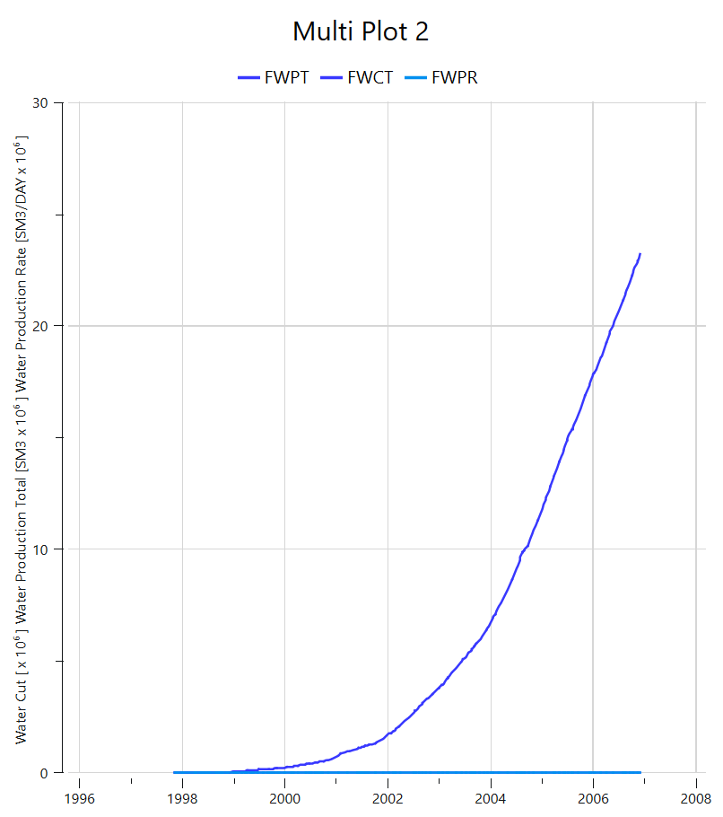

# NORNE Reservoir Simulation – Flow Diagnostics & Well Performance

## Overview

This project explores flow diagnostics and well performance analysis using the NORNE dataset. The simulation and visualization were performed using OPM Flow and ResInsight. The study focuses on evaluating oil production trends, injector support, and individual well behavior.

## Dataset & Tools

- **Dataset**: NORNE Field Dataset (`ATW2013.DATA`, `SMSPEC`, grid files)
- **Software**: 
  - [OPM Flow](https://opm-project.org/)
  - [ResInsight](https://resinsight.org/)
  - WSL2 (Ubuntu) with GNU compilers

---

## Key Visualizations

### 1. Field Total Production  
  
**Interpretation:** Oil production peaked around timestep 2500, followed by a plateau and gradual decline. Injection support correlates with this stabilization phase.

---

### 2. Grid Structure – Early Timestep  
  
**Interpretation:** Active cells are distributed within fault-bounded zones. This early timestep captures high oil saturation regions and identifies potential sweep targets.

---

### 3. Well Comparison – E-4AH vs B-4BH  
  
**Interpretation:**  
- **E-4AH**: Stable BHP and late water breakthrough. Indicates productive, pressure-supported zone.  
- **B-4BH**: Earlier breakthrough and steeper decline. May suggest poor connectivity or sweep inefficiency.

---

### 4. GOR & Water Cut Evolution  
  
**Interpretation:**  
- Post-breakthrough, GOR increased in B-4BH while water cut surged. Suggests gas coning or end-of-life behavior.  
- E-4AH showed more stable fluid ratios, indicating stronger reservoir support.

---

### 5. Field Water Injection (FWIT)  
  
**Interpretation:**  
Injection volumes correlate with stabilization periods. Plateauing injection and BHP values reflect pressure maintenance strategy.

---

## Limitations

This project is based on a deterministic black-oil simulation. No probabilistic or uncertainty quantification was applied. History matching and calibration were not performed. The analysis relies on interpreted visualization outputs without integrating reservoir engineering calculations. Pattern analysis was not implemented but noted as a future enhancement.
