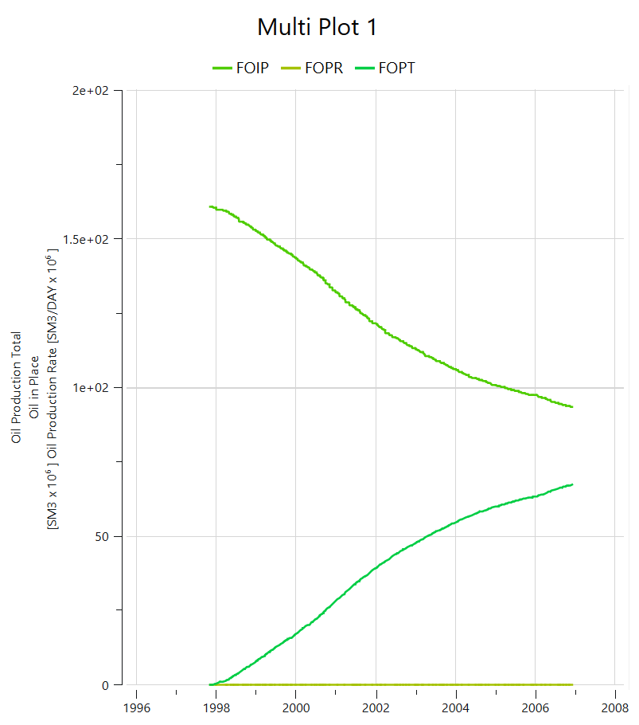

# NORNE Reservoir Simulation – Flow Diagnostics & Well Performance

This project showcases a diagnostic analysis of black-oil reservoir simulation using the publicly available NORNE dataset and the OPM Flow + ResInsight toolchain. The focus is on simulating field behavior, analyzing well diagnostics, and visualizing key performance metrics.

---

## Objectives

- Simulate black-oil production using the NORNE dataset with OPM Flow.
- Visualize performance indicators: production trends, pressure support, water/gas breakthrough.
- Diagnose well performance using injection data and GOR/water cut evolution.
- Compare early vs. late timestep behavior across selected wells.

---

## Tools & Libraries

- [OPM Flow](https://opm-project.org/) – Reservoir simulator  
- [ResInsight](https://www.resinsight.org/) – Visualization  
- WSL2 (Ubuntu on Windows)  
- Python (planned for extended analysis)

---

## Dataset

- Source: [Norne Data Repository – NTNU](https://www.ntnu.edu/ie/norne)  
- Files used:
  - `NORNE_ATW2013.EGRID`
  - `NORNE_ATW2013.SMSPEC`

---

## Key Visualizations

### 1. Field Total Production  
  
**Interpretation:** Oil production peaked around timestep XXX, followed by a plateau and gradual decline. Injection support can be correlated with this stabilization phase.

---

### 2. Grid Structure – Early Timestep  
  
**Interpretation:** Active cells are distributed within fault-bounded zones. This early timestep captures high oil saturation regions and identifies potential sweep targets.

---

### 3. Well Comparison – E-4AH vs B-4BH  
  
**Interpretation:**  
- **E-4AH**: Stable BHP and late water breakthrough. Indicates productive, pressure-supported zone.  
- **B-4BH**: Earlier breakthrough and steeper decline. May suggest poor connectivity or sweep inefficiency.

---

### 4. GOR & Water Cut Evolution  
  
**Interpretation:**  
- Post-breakthrough, GOR increased in B-4BH while water cut surged. Suggests gas coning or end-of-life behavior.  
- E-4AH showed more stable fluid ratios, indicating stronger reservoir support.

---

### 5. Field Water Injection (FWIT)  
  
**Interpretation:**  
Injection volumes correlate with stabilization periods. Plateauing injection and BHP values reflect pressure maintenance strategy.

---

## Key Learnings

- Diagnostics from well summaries and saturation profiles enable early detection of breakthrough.
- Visualization in ResInsight helps correlate grid-level saturation changes with field-level production.
- Understanding spatial reservoir heterogeneity supports targeted development planning.

---

**Author:** Anuri Nwagbara  
**Tools:** OPM Flow, ResInsight, Python (in progress)  
**Status:** Ongoing
