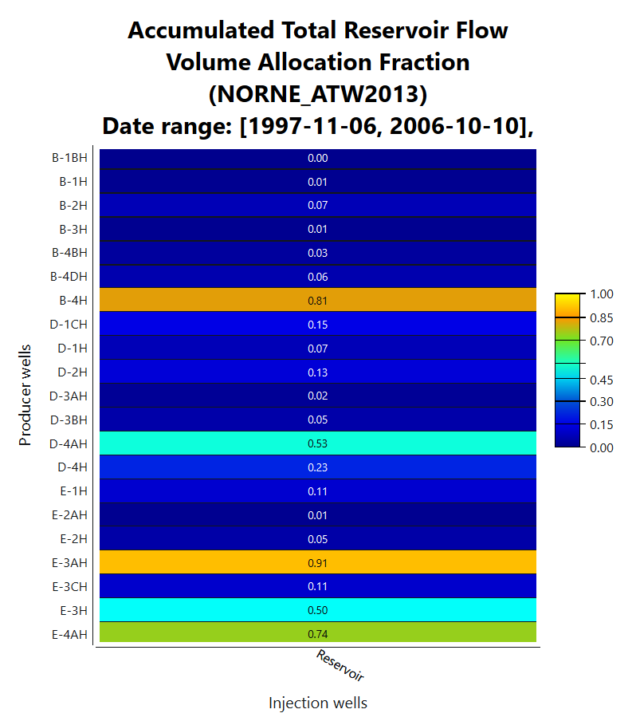

# NORNE Reservoir Simulation – Flow Diagnostics & Well Performance

This project showcases a diagnostic analysis of black-oil reservoir simulation using the publicly available NORNE dataset and the OPM Flow + ResInsight toolchain. The focus is on simulating field behavior, analyzing well diagnostics, and visualizing key performance metrics.

---

## Objectives

- Simulate black-oil production using the NORNE dataset with OPM Flow.  
- Visualize performance indicators: production trends, pressure support, water/gas breakthrough.  
- Diagnose well performance using injection data and GOR/Water cut evolution.  
- Compare early vs. late timestep behavior across selected wells.

---

## Tools & Libraries

- [OPM Flow](https://opm-project.org/) – Reservoir simulator  
- [ResInsight](https://resinsight.org/) – 3D visualization  
- WSL2 (Ubuntu on Windows)  
- Python (planned for extended analysis)

---

## Dataset

- Source: [Norne Data Repository – NTNU](https://www.ntnu.edu/ie/norne)  
- Files used:
  - `NORNE_ATW2013.DATA`
  - `NORNE_ATW2013.SMSPEC`

---

## Key Visualizations

### 1. Field Total Production  
  
**Interpretation:**  
Oil production peaked around timestep 30 (circa 2002), followed by a plateau and gradual decline. Injection support can be correlated with this stabilization phase.

---

### 2. Grid Structure – Early Timestep  
  
**Interpretation:**  
Active cells are distributed within fault-bounded zones. This early timestep captures high oil saturation regions and identifies potential sweep targets.

---

### 3. Well Comparison – E-4AH vs B-4BH  
  
**Interpretation:**  
- **E-4AH**: Stable BHP and late water breakthrough. Indicates productive, pressure-supported zone.  
- **B-4BH**: Earlier breakthrough and steeper decline. May suggest poor connectivity or sweep inefficiency.

---

### 4. GOR & Water Cut Evolution  
  
**Interpretation:**  
- Post-breakthrough, GOR increased in B-4BH while water cut surged. Suggests gas coning or end-of-life behavior.  
- E-4AH showed more stable fluid ratios, indicating stronger reservoir support.

---

### 5. Field Water Injection (FWIT)  
  
**Interpretation:**  
Injection volumes correlate with stabilization periods. Plateauing injection and BHP values reflect pressure maintenance strategy.

---

## Limitations

- The study is based on deterministic black-oil simulation results; no probabilistic or uncertainty quantification was applied.  
- No history-matching or calibration was performed; this is a forward simulation only.  
- Diagnostics rely on interpreted visual outputs, not on in-depth reservoir engineering calculations.  
- Python analysis is currently not implemented — planned as a future enhancement.

---

## Next Steps (Optional / Future Work)

- Integrate Python workflows for time-series analysis and batch visualization.  
- Run well-level diagnostics for additional injectors and producers.  
- Conduct comparative analysis between early and late time steps across all well groups.  
- Explore waterflood optimization or pattern efficiency using streamline-based diagnostics.  
- Extend analysis to include production forecasting (e.g. using DCA or machine learning).

---

## Status

✅ Completed core diagnostic analysis  
🚧 Future work optional – this project is currently archived as a reference portfolio

---
